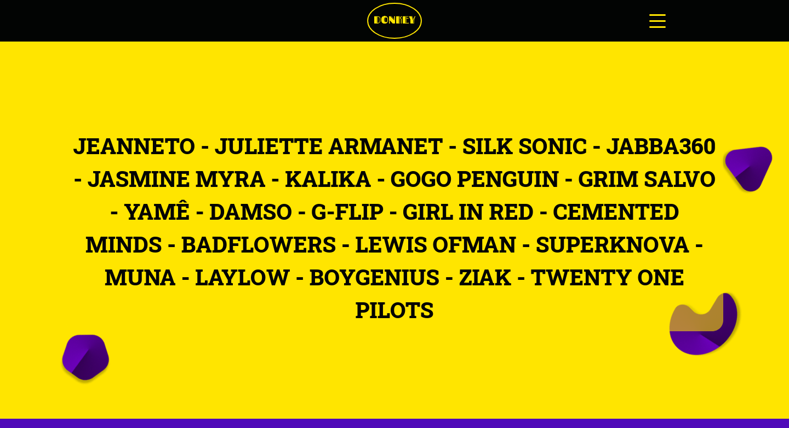

# 🎵 Donkey2.0

HTML | CSS | Sass | JS | PHP | Twig | MySQL

## 🎷 Présentation

Le projet consiste en la création d'un site web dédié au festival de musique Donkey, qui s’est tenu à Rennes du 5 au 7 juillet 2024.

## 🎸 Lien vers le projet

[marionb.alwaysdata.net](marionb.alwaysdata.net)

## 🎛️ Comment installer le projet localement

`git clone https://github.com/Marion1b/Donkey2.0.git`

Se rendre dans le dossier. Depuis le terminal installer les packages npm et composer :

`npm install`

`composer install`

Ajouter un fichier .env, y ajouter vos informations en suivant le modèle du fichier .env.example.

Reprendre la base de données "marionbarthoux_donkey.sql".

## 🎺 Disclaimer

Donkey est le résultat de mon projet de fin de formation. Donkey est un festival *fictif* qui n'a jamais eu lieu. Il s'agit d'un site web que j'ai développé personnellement, mettant en valeur mes compétences et mes connaissances en développement web. Le projet n'a pas d'objectif financier et ne collecte pas de données auprès de ses utilisateurs. Donkey est un projet qui m'a permis d'appliquer ce que j'ai appris pendant ma formation. Le but principal du projet est  de démontrer mes compétences sans aucun gain financier ou collecte de données.